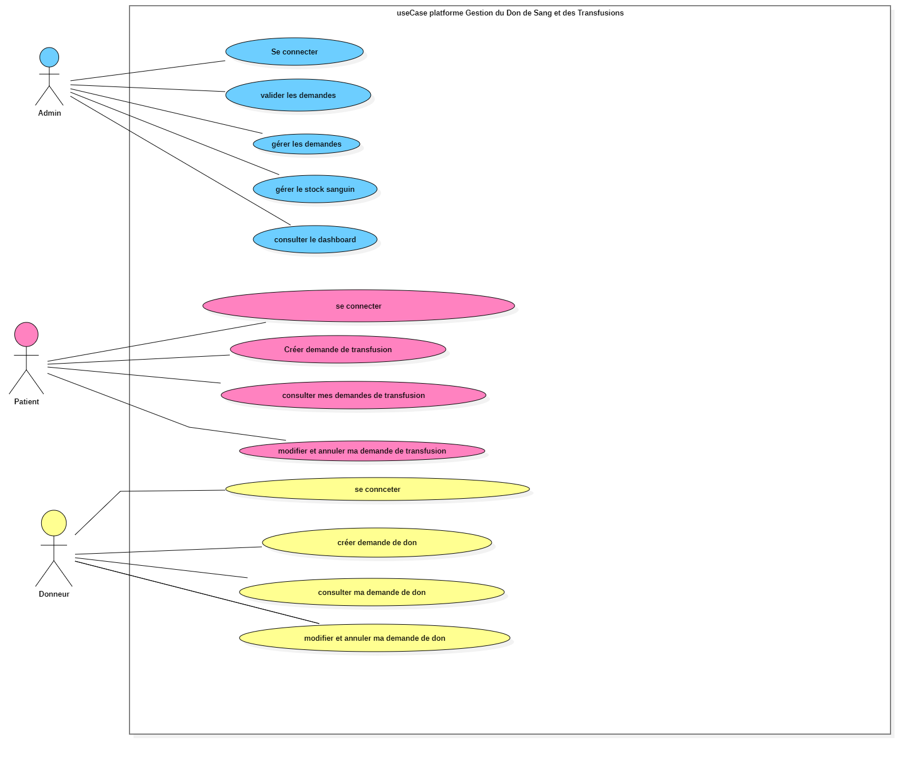
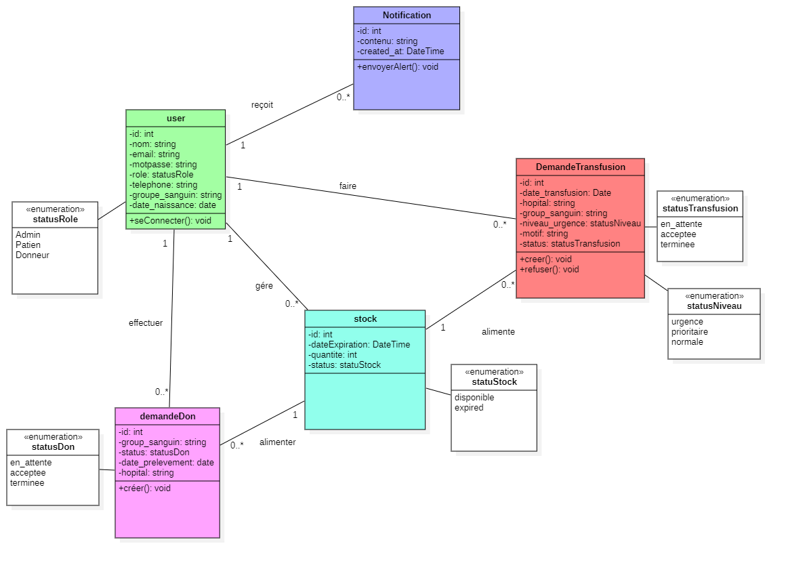
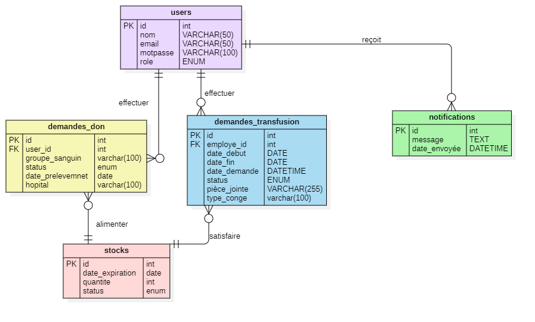

  
# 🩸 Sharayan

## 📖 Présentation

**Sharayan** est une application web dédiée à la gestion du don et de la transfusion sanguine.

L'application permet de faciliter la gestion des demandes de don et de transfusion, le suivi des utilisateurs ainsi que la gestion du stock de sang par l'administrateur.

Le projet a été réalisé dans le cadre de ma formation en **Développement Full Stack** avec une architecture séparant le frontend et le backend.

---

## 🎯 Objectifs

Les principaux objectifs de l'application sont :

- Faciliter les demandes de don de sang.
- Faciliter les demandes de transfusion sanguine.
- Permettre aux patients de suivre leurs demandes.
- Permettre aux donneurs de gérer leurs demandes de don.
- Permettre à l'administrateur de gérer et valider les demandes.
- Gérer le stock de sang.
- Suivre les différents groupes sanguins disponibles.
- Centraliser les informations des donneurs et des patients.

---

# 👥 Utilisateurs de l'application

L'application possède trois rôles principaux :

### 👤 Patient

Le patient peut :

- Créer une demande de transfusion.
- Consulter l'historique de ses demandes.
- Consulter le statut de sa demande.
- Modifier une demande lorsque son statut est `en_attente`.
- Annuler une demande lorsque son statut est `en_attente`.
- Consulter et modifier ses informations personnelles.

### 🩸 Donneur

Le donneur peut :

- Créer une demande de don.
- Consulter l'historique de ses demandes.
- Modifier une demande lorsque son statut est `en_attente`.
- Supprimer une demande lorsque son statut est `en_attente`.
- Suivre le statut de sa demande.
- Consulter et modifier ses informations personnelles.

### 👨‍💼 Administrateur

L'administrateur peut :

- Consulter les demandes de don.
- Valider une demande de don.
- Refuser une demande de don.
- Consulter les demandes de transfusion.
- Traiter les demandes de transfusion.
- Gérer le stock sanguin.
- Suivre les différents groupes sanguins.
- Gérer les utilisateurs.

---

# 🛠️ Technologies utilisées

## Backend

- **PHP**
- **Laravel**
- **Laravel Sanctum**
- **MySQL**
- **API REST**

## Frontend

- **React.js**
- **JavaScript**
- **Tailwind CSS**
- **Axios**
- **React Router**
- **Vite**

## Outils

- **Visual Studio Code**
- **Git**
- **GitHub**
- **Docker**
- **Docker Compose**
- **Postman**
- **StarUML**
- **Figma**

---

# 🏗️ Architecture du projet

Le projet est organisé en deux parties principales :

Sharayan/
│
├── sharayan-backend/
│
├── sharayan-frontend/
│
├── docker-compose.yml
│
└── README.md

## 📊 Diagrammes UML

### Diagramme de cas d'utilisation

### Diagramme de classes

### Diagramme ERD

---

# 🐳 Docker

Le projet Sharayan utilise **Docker** et **Docker Compose** afin de faciliter la configuration et l'exécution de l'environnement de développement.

L'environnement Docker contient :

- un conteneur pour le backend Laravel ;
- un conteneur pour le frontend React ;
- un conteneur pour la base de données MySQL.

## 📦 Architecture Docker

Sharayan
│
├── sharayan-backend
│   └── Laravel
│
├── sharayan-frontend
│   └── React + Vite
│
├── MySQL
│
└── docker-compose.yml